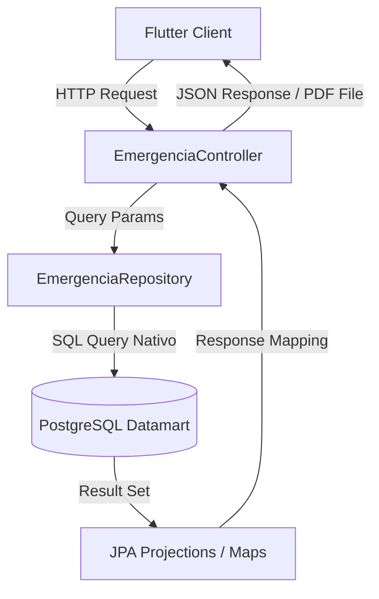

# API REST: Sistema de Inteligencia y Soporte a Decisiones para Emergencias Nacionales

[](https://spring.io/projects/spring-boot)
[](https://openjdk.org/)
[](https://www.postgresql.org/)
[](https://itextpdf.com/)
[](./README.md)


## Equipo de Desarrollo:

Este proyecto es el resultado del trabajo conjunto del equipo de desarrollo, compuesto por especialistas en frontend y backend.

| Integrante | Matrícula | Rol Principal |
| :--- | :--- | :--- |
| **MARTÍNEZ MENDOZA JESÚS ÁNGEL** | 22161152 | Frontend Lead / Arquitectura |
| **DIEGO GARCIA JENNIFER** | 22161050 | Frontend Developer / UI-UX |
| **ELORZA PÉREZ JOAQUÍN BARUC** | 22161052 | Frontend Developer / Integración |
| **CANDELARIA VELAZQUEZ RODRIGO** | 22161014 | Backend Developer / Base de Datos |
| **GARCÍA GALLEGOS ERIC** | 22161068 | Backend Developer / API REST |
| **HERNANDEZ SORIANO MANUEL** | 22161097 | Backend Lead / Arquitectura |

---

## Definición del Sistema
El Sistema de Soporte a Decisiones (DSS) es una plataforma de Inteligencia de Negocios diseñada para procesar, consolidar y visualizar datos masivos de incidencias delictivas y emergencias viales a nivel nacional. Su objetivo principal es transformar información cruda en inteligencia operativa accionable mediante procesos ETL y el análisis de Indicadores Clave de Rendimiento (KPIs). Esta herramienta proporciona a los altos mandos y centros de monitoreo una interfaz gerencial para identificar patrones geoespaciales y temporales, permitiendo optimizar la asignación de recursos, reducir tiempos de respuesta y formular estrategias tácticas basadas en evidencia algorítmica y matemática.

> **Nota de Navegación:** Este es el repositorio de **Backend**. Para ver la otra mitad del sistema, visita el [Repositorio Frontend](https://github.com/jangelmm/frontend-emergencias-app).

---


Este repositorio contiene la **Célula Backend** del proyecto, implementada como una **API REST de solo lectura** con Java y Spring Boot. Su función es consumir la base de datos preprocesada del *Data Mart* de emergencias (generada en PostgreSQL por el pipeline ETL) y exponer endpoints analíticos de alta velocidad y un generador de reportes PDF premium para alimentar la aplicación cliente móvil desarrollada en **Flutter**.

---


## Arquitectura del Backend

El backend sigue un patrón **MVC Simplificado y Optimizado** diseñado para minimizar el consumo de memoria ante consultas analíticas complejas mediante el uso de **Spring Data JPA Projections** e inyección directa de consultas nativas (`nativeQuery = true`).



---

## Stack Tecnológico

* **Lenguaje:** openJDK Java 17 o superior.
* **Framework:** Spring Boot 3.x (Spring WebMVC, Spring Data JPA).
* **Librería PDF:** iTextPDF (5.5.13.3) para la compilación y renderizado dinámico de reportes ejecutivos.
* **ORM:** Hibernate (validado como de solo lectura mediante `ddl-auto=none`).
* **Utilidades:** Project Lombok para la reducción de código repetitivo (*Boilerplate*).

---

## Estructura de Paquetes

```
src/main/java/com/example/apiemergencias/
│
├── ApiEmergenciasApplication.java   # Clase de arranque (Application Entrypoint)
│
├── controller/
│   └── EmergenciaController.java      # Controlador REST & API Endpoints & Reporte PDF
│
├── model/
│   └── EmergenciaConsolidada.java     # Entidad JPA para la tabla consolidada
│
├── projection/                        # Interfaces para optimización de mapeo SQL
│   ├── ProporcionNacionalProjection.java
│   ├── SaturacionEstadoProjection.java
│   └── TendenciaHistoricaProjection.java
│
└── repository/
    └── EmergenciaRepository.java      # Consultas nativas avanzadas (Filtros dinámicos)
```

---

## Mapeo del Data Mart

El backend se conecta a la tabla física `emergencias_nacionales_consolidado` del pipeline ETL sin permisos de escritura ni modificación de esquemas.

```java
@Entity
@Table(name = "emergencias_nacionales_consolidado")
public class EmergenciaConsolidada {
    @Id
    @Column(name = "estado")
    private String estado;
    
    @Column(name = "fecha")
    private String fecha;
    
    @Column(name = "total_delitos")
    private Long totalDelitos;
    
    @Column(name = "total_accidentes")
    private Long totalAccidentes;
    
    @Column(name = "total_emergencias")
    private Long totalEmergencias;
}
```

---

## Configuración y Ejecución Local

### Paso 1: Clonar el repositorio
```bash
git clone https://github.com/ManuHernandezDev/backend-emergencias-api.git
cd backend-emergencias-api
git checkout develop
```

### Paso 2: Configurar las variables de entorno
El archivo `src/main/resources/application.properties` está configurado para consumir credenciales seguras a través del entorno de ejecución. Configura las siguientes variables en tu sistema o IDE:

| Variable | Descripción | Valor Ejemplo |
|---|---|---|
| `DB_USER` | Usuario de tu instancia local de PostgreSQL | `postgres` |
| `DB_PASSWORD` | Contraseña de acceso a PostgreSQL | `mi_password_seguro` |

*Alternativamente, puedes declarar los valores directamente en `application.properties` (no recomendado para producción).*

### Paso 3: Compilar y Ejecutar con Maven
Asegúrate de tener instalado Java 17+. Usa el wrapper de Maven incluido en el proyecto:

```bash
# En Windows (PowerShell)
./mvnw.cmd spring-boot:run

# En Linux/macOS
chmod +x mvnw
./mvnw spring-boot:run
```

El servidor web arrancará en el puerto por defecto: `http://localhost:8080`.

---

## Contratos de API (Endpoints)

Todos los endpoints incorporan la anotación `@CrossOrigin(origins = "*")` para permitir el consumo inmediato desde simuladores o dispositivos móviles con Flutter sin restricciones de CORS.

### Parámetros Generales de Filtro (Query Params)
Casi todos los endpoints analíticos aceptan los siguientes filtros opcionales para la segmentación del dashboard:
* `estado` (String): Filtro por entidad federativa (Ej. `Ciudad de México`, `Jalisco`).
* `anio` (Integer): Filtro de año (Ej. `2024`, `2023`).
* `trimestre` (String): Filtro por trimestre del año (`T1`, `T2`, `T3`, `T4`).

---

### 1. Saturación Operativa (KPI 1)
Retorna la suma total de emergencias agrupadas por estado e indica el nivel de alerta operativo basado en reglas de negocio dinámicas.

* **URL:** `GET /api/v1/kpi/saturacion`
* **Params Opcionales:** `estado`, `anio`, `trimestre`
* **Respuesta Exitosa (200 OK):**
  ```json
  {
    "status": "success",
    "data": [
      {
        "estado": "Ciudad de México",
        "totalEmergencias": 927,
        "nivelAlerta": "VERDE"
      },
      {
        "estado": "Estado de México",
        "totalEmergencias": 831,
        "nivelAlerta": "VERDE"
      }
    ]
  }
  ```

---

### 2. Tendencia Histórica Mensual (KPI 2)
Obtiene el desglose de los delitos operativos vs accidentes viales con una escala temporal a nivel de mes.

* **URL:** `GET /api/v1/kpi/tendencia`
* **Params Opcionales:** `estado`, `anio`, `trimestre`
* **Respuesta Exitosa (200 OK):**
  ```json
  {
    "status": "success",
    "data": [
      {
        "fecha": "2024-01",
        "accidentesViales": 351,
        "delitosRegistrados": 576
      },
      {
        "fecha": "2024-02",
        "accidentesViales": 320,
        "delitosRegistrados": 530
      }
    ]
  }
  ```

---

### 3. Proporción del Tipo de Incidente (KPI 3)
Calcula y formatea la carga porcentual que representa cada tipo de incidente sobre el total nacional o estatal.

* **URL:** `GET /api/v1/kpi/proporcion`
* **Params Opcionales:** `estado`, `anio`, `trimestre`
* **Respuesta Exitosa (200 OK):**
  ```json
  {
    "status": "success",
    "data": [
      {
        "tipo": "Accidentes Viales",
        "porcentaje": 37.1
      },
      {
        "tipo": "Delitos Operativos",
        "porcentaje": 62.9
      }
    ]
  }
  ```

---

### 4. Crecimiento Interanual (KPI 4)
Calcula la tasa de crecimiento de emergencias comparando el año seleccionado contra su año anterior inmediato.

* **URL:** `GET /api/v1/kpi/comparativa`
* **Params Opcionales:** `anio` (Default: `2024`), `estado`, `trimestre`
* **Regla de Negocio Especial:** Si se solicita el año `2022`, la tendencia devuelve `"INFO"` y el payload incluye un mensaje especial advirtiendo que no se registran datos del 2021.
* **Respuesta Exitosa (200 OK):**
  ```json
  {
    "status": "success",
    "data": {
      "kpi": "Crecimiento Interanual",
      "estado": "Nacional",
      "anioActual": 2024,
      "totalActual": 6061,
      "anioAnterior": 2023,
      "totalAnterior": 5890,
      "tendencia": "ALZA",
      "porcentajeCambio": 2.9
    }
  }
  ```

---

### 5. Días Críticos de Emergencias (KPI 5)
Permite mapear qué días de la semana (Lunes a Domingo) presentan la mayor congestión e impacto en la recepción de llamadas de emergencia.

* **URL:** `GET /api/v1/kpi/dias-criticos`
* **Params Opcionales:** `estado`, `anio`, `trimestre`
* **Respuesta Exitosa (200 OK):**
  ```json
  {
    "status": "success",
    "data": [
      {
        "dia": "Lunes",
        "totalEmergencias": 1250
      },
      {
        "dia": "Viernes",
        "totalEmergencias": 2100
      }
    ]
  }
  ```

---

### 6. Descarga de Reporte Ejecutivo PDF Premium
Compila al vuelo toda la información analítica de los KPIs e inyecta los resultados en un reporte PDF profesional y estilizado con una cabecera corporativa y paleta de colores del Centro de Mando 911.

* **URL:** `GET /api/v1/kpi/reportes/generar`
* **Params Opcionales:** `anio`, `estado`, `trimestre`
* **Respuesta Exitosa (200 OK):** Retorna un flujo de bytes con `Content-Type: application/pdf` y cabecera de descarga de archivo adjunto `attachment; filename=Reporte_Ejecutivo_911.pdf`.

> [!TIP]
> Este endpoint utiliza la librería **iText** con celdas acolchadas (*cell padding*), bordes suaves y avisos en colores de alerta (rojo/verde) dependiendo de la tendencia del crecimiento operativo.

---

## Solución de Problemas (Troubleshooting)

### 1. Error de conexión a la base de datos (PostgreSQL)
Si al arrancar el backend recibes un error de `Connection Refused` o credenciales erróneas:
* Verifica que tu servidor local PostgreSQL esté corriendo en el puerto `5432`.
* Cerciórate de haber exportado correctamente las variables `DB_USER` y `DB_PASSWORD`. En PowerShell puedes hacerlo con:
  ```powershell
  $env:DB_USER="tu_usuario"
  $env:DB_PASSWORD="tu_password"
  ```

### 2. Error al intentar modificar tablas
Spring Boot está configurado para no realizar operaciones DDL:
`spring.jpa.hibernate.ddl-auto=none`
Esto evita que se modifique o trunque la tabla alimentada por el ETL. No intentes cambiar esta configuración.

### 3. Excepción de iTextPDF
Si recibes errores de compilación al invocar el reporte PDF:
* Revisa que la dependencia en el archivo `pom.xml` esté correctamente descargada.
* El endpoint de PDF maneja los trimestres convirtiendo valores de entrada (`T1`, `T2`, etc.) a enteros. Si ingresas un valor inválido, se omitirá el filtro por defecto.


